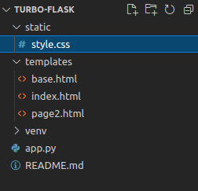

# Aplicación con Turbo Flask

## Descripción
Esta es una aplicación de muestra para probar la extensión Turbo Flask que permite actualizar parte de la pagína web de manera asincrónica, sin necesidad de refrescar para visualizar los cambios.

Se puede obtener más información de Turbo Flask en el Github del [Proyecto](https://github.com/miguelgrinberg/turbo-flask).

Importante destacar que Turbo Flask es un proyecto de [Miguel Grinberg](https://github.com/miguelgrinberg) intengrando la biblioteca [Turbo.js](https://github.com/hotwired/turbo) con Flask

Para este ejemplo utilizo como guía el tutorial practico esctrito por Miguel en su [blog](https://blog.miguelgrinberg.com/post/dynamically-update-your-flask-web-pages-using-turbo-flask).

## Instalación

En su ambiente virtual instalar Flask 2 y Turbo Flask

```
(venv) $ pip3 install flask turbo-flask

```

## Detalles

### Estructura
Al tratarse de un proyecto para pruebas la estructura es sencilla pero dejo la imagen como guía por si esta inciando con Flask.




### Templates
Dentro de nuestra habitual carpeta Templates de Flask tenemos 3 archivos html, index, page2 y base. 

Utilizamos base como una buena practica de Flask ya que las otras páginas repiten esta estructura.

### Static

También es una carpeta muy utilizada en Flask para almacenar las imagenes, archivos CSS y JS. 

Aquí tenemos nuestro diseño personalizado con CSS

### aap.py
Siguiendo el tutorial de Miguel vamos a crear una web que nos muestre las cargas del CPU en los últimos 1, 5 y 15 minutos, estos datos se actualizaran de manera automatica, la muestra de esta infomración de CPU está diseñada para servidores Linux, pero para continuar con el ejemplo se agrega un código que muestra numero de manera aleatoria si el sistema operativo no es Linux. 

```python

@app.context_prrocessor
def inject_load():
    if sys.platform.startswith('linux'):
        with open('/proc/loadavg', 'rt') as f:
            load = f.read().split()[0:3]
    else:
        load = [int(random.random() * 100) / 100 for _ in range(3)]
    return{'load1': load[0], 'load5': load[1], 'load15': load[2]}

```


